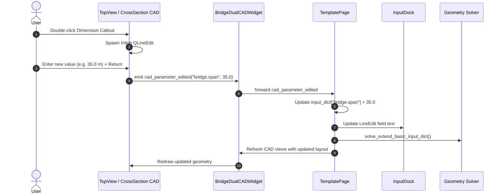

# OsdagBridge Enhancements: Interactive 2D CAD, Dialog State Management, and Transverse Member Plotting

**Project:** OsdagBridge (FOSSEE / Indian Institute of Technology Bombay)  
**Branch Target:** `dev` (Upstream: `Nidhikhare12:dev`)  
**Task Module:** Task 3 — UI, 2D CAD & Plotting Enhancements  
**Status:** Completed & Verified (19/19 Unit Tests Passing)  

---

## 1. Executive Summary

OsdagBridge is an open-source, standards-compliant bridge design and finite-element analysis environment for steel-concrete composite plate girder bridges built upon PySide6, OpenSeesPy, and Ospgrillage. This report documents the design, architecture, and verification of **Task 3: UI, 2D CAD & Plotting Enhancements**.

The work accomplished delivers three key functional and usability capabilities:
1. **Interactive 2D CAD Parameter Editing**: Transitioned static 2D CAD drawing views (`TopViewCADWidget`, `CrossSectionCADWidget`, and `BridgeDualCADWidget`) into interactive graphical parameter editors. Users can double-click dimension callouts, edit numerical values in place with floating validators, and observe automatic bidirectional updates across input docks, solver models, and drawing canvases.
2. **Additional Inputs Validation & State Management**: Implemented dirty-state tracking (`is_modified`), comprehensive validation guardrails for custom inputs (Crash Barriers, Medians, Railings, Wearing Course, Wind, and custom plate girder geometries), and safety prompts upon dialog closing with safe deep-copy reversion.
3. **Transverse Member Result Extraction & Plotting**: Isolated transverse finite elements (cross-girders, diaphragms, and cross-bracings) from longitudinal girders. Extracted the complete set of nodal response components ($F_x, V_y, V_z, T_x, M_y, M_z$ and $D_x, D_y, D_z$) and incorporated Transverse Members into the output dock selector, graph engines, and 3D visualizers for Shear Force Diagrams (SFD), Bending Moment Diagrams (BMD), and Deflection diagrams.

---

## 2. Architectural Scaffolding & Centralized Constants

To uphold software quality and eliminate magic strings across the codebase, centralized constants were defined in `src/osdagbridge/core/utils/common.py`.

```python
# ==============================================================================
# ADDITIONAL INPUTS & CUSTOM VALIDATION CONSTANTS
# ==============================================================================
VALUE_CUSTOM: str = "Custom"
KEY_CUSTOM: str = "Custom"

# ==============================================================================
# TRANSVERSE MEMBER ANALYSIS CONSTANTS
# ==============================================================================
KEY_TRANSVERSE_MEMBERS: str = "Transverse Members"
DISP_TRANSVERSE_MEMBERS: str = "Transverse Members"
```

### Key Rationale
- **Single Source of Truth**: UI combobox values, schema definitions, internal dictionary keys, and plot dropdown identifiers share exact string references.
- **Maintainability**: Prevents subtle regressions caused by typos in string literals such as `"Custom"` or `"Transverse Members"`.
- **Backward Compatibility**: Fully compatible with existing serialized input dictionaries and test harnesses.

---

## 3. Task I: Interactive 2D CAD Parameter Editing

### 3.1 Hit-Testing & Dimension Callouts
During the drawing pass of `draw_top_view` and `draw_cross_section`, text rendering methods were augmented to register bounding rectangles and parameter metadata into `self.dimension_callouts`:

```python
self.dimension_callouts.append({
    "rect": bg_rect,
    "param_key": param_key,
    "display_name": display_name,
    "is_editable": is_editable,
    "unit": unit,
    "current_val": current_val,
    "param_name": param_name,
})
```

### 3.2 Editable vs. Locked Parameters
Parameters were segregated based on whether they represent independent design variables or geometrically derived quantities:

| Parameter Name | Param Key | Editable? | Classification / Behavior |
| :--- | :--- | :---: | :--- |
| **Span Length** | `KEY_SPAN` | **Yes** | Independent longitudinal dimension ($m \leftrightarrow mm$). |
| **Girder Spacing** | `KEY_TS_GIRDER_SPACING` | **Yes** | Independent transverse girder spacing ($m \leftrightarrow mm$). |
| **Deck Thickness** | `KEY_TS_DECK_THICKNESS` | **Yes** | Independent cross-section deck slab thickness ($mm$). |
| **Carriageway Width** | `KEY_CARRIAGEWAY_WIDTH` | **Yes** | Independent vehicular carriageway width ($m \leftrightarrow mm$). |
| **Overhang** | `KEY_TS_DECK_OVERHANG` | **No (Locked)** | Derived quantity: $(W_{\text{total}} - (N-1) \cdot S_g) / 2$. Shows informative tooltip. |
| **Overall Bridge Width**| `KEY_TS_OVERALL_WIDTH` | **No (Locked)** | Derived quantity: Carriageway + Footpaths + Crash Barriers + Median. |
| **Bracing Spacing** | `KEY_TS_BRACING_SPACING` | **No (Locked)** | Derived quantity based on span partition rules. |
| **Footpath Width/Thickness** | Various | **No (Locked)** | Configured via Additional Inputs dialog. |

### 3.3 Inline Floating Editor (`_show_inline_editor`)
When a user double-clicks the canvas:
1. `mouseDoubleClickEvent` transforms click coordinates from viewport space to widget space (accounting for pan offsets and zoom scaling).
2. It performs point-in-polygon hit-testing against `self.dimension_callouts`.
3. If an editable callout is clicked, a floating `QLineEdit` with styled border and high-contrast background is spawned over the text.
4. Input is validated using `QDoubleValidator(bottom=0.001)`.
5. Upon pressing **Enter** or losing focus, the editor:
   - Validates that the numeric value is strictly positive ($> 0$).
   - Converts the value from display units ($m$ or $mm$) to internal parameters.
   - Emits `self.cad_parameter_edited.emit(param_key, val_in_meters)`.
   - Triggers `self.update()`.

### 3.4 Signal-Slot Synchronization
- **In `BridgeDualCADWidget` (`cad_dual_view.py`)**: Intercepts edits from either the top-view or cross-section child canvas, updates the synchronized `params` dictionary in both child widgets, and forwards `cad_parameter_edited`.
- **In `TemplatePage` (`template_page.py`)**: Connects `cad_parameter_edited` to `_on_cad_parameter_edited`. Updates `self.input_dict`, synchronizes line edits in `InputDock`, executes `solve_extend_basic_input_dict()` to recalculate derived overhangs and bridge widths, and invokes CAD widget redraws.



---

## 4. Task II: Additional Inputs Validation & State Management

### 4.1 Dirty State Tracking (`is_modified`)
The `AdditionalInputs` dialog (`additional_inputs.py`) maintains an explicit modification flag:
- **Initialization**: Initialized to `False` in `__init__` and preserved as `False` after building tabs and loading initial default dictionaries.
- **Mutation Tracking**: Every line edit modification, combobox change, tab reset, table row edit, stiffener/flange copy, and boundary adjustment sets `self.is_modified = True`.
- **Save Reset**: On successful validation and commit in `_save_inputs()`, `self.is_modified` resets to `False`.

### 4.2 Validation on Save (`_validate_custom_inputs`)
Before committing changes to `default_input_dict`, `_validate_custom_inputs()` inspects all active components configured with mode `"Custom"`:

```python
def _validate_custom_inputs(self) -> list[str]:
    errors = []
    d = self.working_input_dict

    def _check_empty(key: str, name: str):
        val = d.get(key)
        if val is None or str(val).strip() == "":
            errors.append(f"The custom value for '{name}' cannot be empty.")

    # 1. Crash Barrier
    if d.get(KEY_CB_TYPE) == VALUE_CUSTOM:
        _check_empty(KEY_CB_DENSITY, "Crash Barrier Material Density")
        _check_empty(KEY_CB_WIDTH, "Crash Barrier Width")
        _check_empty(KEY_CB_HEIGHT, "Crash Barrier Height")
        _check_empty(KEY_CB_AREA, "Crash Barrier Area")
        _check_empty(KEY_CB_LOAD, "Crash Barrier Load")

    # 2. Median (if enabled)
    if d.get(KEY_INCLUDE_MEDIAN) == VALUES_NO_YES[1] and d.get(KEY_MD_TYPE) == VALUE_CUSTOM:
        _check_empty(KEY_MD_DENSITY, "Median Material Density")
        _check_empty(KEY_MD_WIDTH, "Median Width")
        _check_empty(KEY_MD_HEIGHT, "Median Height")
        _check_empty(KEY_MD_AREA, "Median Area")
        _check_empty(KEY_MD_LOAD, "Median Load")

    # 3. Railing (if footpath enabled)
    if d.get(KEY_FOOTPATH) in (VALUES_FOOTPATH[1], VALUES_FOOTPATH[2]):
        if d.get(KEY_RL_TYPE) == VALUE_CUSTOM:
            _check_empty(KEY_RL_WIDTH, "Railing Width")
            _check_empty(KEY_RL_HEIGHT, "Railing Height")
        if d.get(KEY_RL_LOAD_MODE) == VALUE_CUSTOM:
            _check_empty(KEY_RL_LOAD_VALUE, "Railing Load")

    # 4. Wearing Course
    if d.get(KEY_WC_MATERIAL) == VALUE_CUSTOM:
        _check_empty(KEY_WC_DENSITY, "Wearing Course Density")
        _check_empty(KEY_WC_THICKNESS, "Wearing Course Thickness")

    # 5. Wind Load Mode-Line Fields
    wind_fields = [
        (KEY_WL_GUST_FACTOR, "Gust Factor, G"),
        (KEY_WL_DRAG_COEFF, "Drag Coefficient, CD"),
        (KEY_WL_DRAG_COEFF_LL, "Drag Coefficient against Live Load, CDLL"),
        (KEY_WL_LIFT_COEFF, "Lift Coefficient, CL"),
        (KEY_WL_SUPER_AREA_ELEV, "Superstructure Area in Elevation, A1"),
        (KEY_WL_SUPER_AREA_PLAIN, "Superstructure Area in Plain, A3"),
        (KEY_WL_EXPOSED_FRONTAL, "Exposed Frontal Area of Live Load, A1LL"),
        (KEY_WL_WIND_ECC_DECK, "Wind Load Eccentricity from Top of Deck"),
        (KEY_WL_WIND_LL_ECC, "Wind on Live Load Eccentricity from Top of Deck"),
    ]
    for field_id, field_name in wind_fields:
        if d.get(field_id + ".mode") == VALUE_CUSTOM:
            _check_empty(field_id + ".value", field_name)

    # 6. Plate Girder Custom Geometry
    if d.get(KEY_DESIGN_MODE) == VALUE_CUSTOM:
        _check_empty(KEY_MP_GIRDER_DEPTH, "Girder Depth")
        _check_empty(KEY_MP_GIRDER_TOP_FLANGE_WIDTH, "Top Flange Width")
        _check_empty(KEY_MP_GIRDER_TOP_FLANGE_THICKNESS, "Top Flange Thickness")
        _check_empty(KEY_MP_GIRDER_BOTTOM_FLANGE_WIDTH, "Bottom Flange Width")
        _check_empty(KEY_MP_GIRDER_BOTTOM_FLANGE_THICKNESS, "Bottom Flange Thickness")
        _check_empty(KEY_MP_GIRDER_WEB_THICKNESS, "Web Thickness")

    return errors
```

If errors exist, save is aborted and a `CustomMessageBox` warning modal presents the error list.

### 4.3 Unsaved Changes Interception (`closeEvent`)
The dialog overrides `closeEvent` to ensure user edits are never discarded unintentionally:

```python
def closeEvent(self, event):
    if self.is_modified:
        msg = CustomMessageBox(
            title="Unsaved Changes",
            text="You have unsaved changes. Closing this window will discard them. Do you want to proceed?",
            buttons=["Discard", "Cancel"],
            dialogType=MessageBoxType.Warning,
            parent=self,
        )
        msg.exec()
        if msg.clicked_button == "Discard":
            self.working_input_dict = deepcopy(self.default_input_dict)
            self.is_modified = False
            event.accept()
        else:
            event.ignore()
    else:
        event.accept()
```

---

## 5. Task III: Transverse Member Analysis Results & Plotting

### 5.1 Geometric Member Isolation
In `PlateGirderAnalysisResults` (`analysis_results.py`), transverse members (cross-girders, diaphragms, and cross-bracings) are programmatically distinguished from longitudinal members by inspecting the coordinates of connected end-nodes:

```python
def build_transverse_members(self) -> dict:
    """Extract and structure all transverse element tags and connected nodes."""
    nodes, elements, _ = self.build_grillage_connectivity()
    _z_tol = 1e-3
    t_elements = []
    t_nodes_set = set()
    element_map = []
    for eid, (n1, n2) in elements.items():
        if n1 not in nodes or n2 not in nodes:
            continue
        c1, c2 = nodes[n1], nodes[n2]
        # Transverse members: nodes differ in Z or not strictly longitudinal in Z and Y
        if not (abs(c1[2] - c2[2]) < _z_tol and abs(c1[1] - c2[1]) < _z_tol):
            t_elements.append(eid)
            t_nodes_set.add(n1)
            t_nodes_set.add(n2)
            element_map.append((eid, n1, n2))

    sorted_nodes = sorted(list(t_nodes_set), key=lambda n: (nodes[n][2], nodes[n][0]))
    return {
        "elements": t_elements,
        "nodes": sorted_nodes,
        "element_map": element_map,
    }
```

### 5.2 Response Extraction Data Pipeline
The query methods `_get_forces_df()`, `_get_displacements_df()`, and `_get_node_coords_df()` were augmented to handle `"Transverse Members"`:
- **Forces**: Extracts axial ($F_x$), shear ($V_y, V_z$), torsion ($T_x$), and bending ($M_y, M_z$) at $i$- and $j$-nodes for all transverse elements across all load cases and combinations.
- **Displacements**: Extracts translations ($D_x, D_y, D_z$) sorted along the transverse $Z$-axis.
- **Coordinates**: Maps transverse element nodes sorted by $(Z, X)$ coordinates for spatial alignment in plotting engines.

### 5.3 Plotting & Visualizer Integration
- **Output Dock (`output_dock.py`)**: `refresh_member_dropdown()` appends `DISP_TRANSVERSE_MEMBERS` ("Transverse Members") to the analysis member combobox (`combo_analysis`).
- **Graph Engine (`graph_engine.py`)**: `get_girder_keys()` includes `"Transverse Members"`; `_build_x_array()` scales distance along the transverse width axis ($Z$).
- **3D Plot Generator (`plot_generator.py`)**:
  - `_get_bg_nodes_members()` filters and displays only transverse elements when `"Transverse Members"` is selected.
  - `build_figure_sfd()`, `build_figure_bmd()`, and `build_figure_deflection()` automatically group transverse elements by transverse line ($X_{\text{mid}}$) and generate 3D diagram surfaces along the bridge cross-width.

---

## 6. Automated Testing Suite

A suite of 19 comprehensive unit tests was developed and executed to validate the entire enhancement scope.

### 6.1 Test Breakdown Table

| Test File | Test Name | Target Functionality / Assertions | Result |
| :--- | :--- | :--- | :---: |
| `test_additional_inputs_validation.py` | `test_additional_inputs_initial_state` | Asserts `is_modified == False` upon initialization. | **PASSED** |
| `test_additional_inputs_validation.py` | `test_additional_inputs_modified_flag_on_update` | Asserts `is_modified == True` after calling `_update_input_dict`. | **PASSED** |
| `test_additional_inputs_validation.py` | `test_custom_validation_empty_crash_barrier` | Asserts error emitted when Crash Barrier custom fields are empty. | **PASSED** |
| `test_additional_inputs_validation.py` | `test_custom_validation_valid_crash_barrier` | Asserts validation passes when custom Crash Barrier fields are valid. | **PASSED** |
| `test_additional_inputs_validation.py` | `test_custom_validation_empty_median` | Asserts error emitted when enabled custom Median has missing fields. | **PASSED** |
| `test_additional_inputs_validation.py` | `test_custom_validation_empty_railing` | Asserts error emitted when custom Railing has empty geometry. | **PASSED** |
| `test_additional_inputs_validation.py` | `test_custom_validation_empty_wearing_course` | Asserts error emitted when custom Wearing Course density is empty. | **PASSED** |
| `test_additional_inputs_validation.py` | `test_custom_validation_empty_wind_load` | Asserts error emitted when custom Wind gust factor is empty. | **PASSED** |
| `test_additional_inputs_validation.py` | `test_custom_validation_empty_girder_custom` | Asserts error emitted when custom Girder depth is empty. | **PASSED** |
| `test_additional_inputs_validation.py` | `test_close_event_unmodified` | Asserts `closeEvent` accepts immediately when unmodified. | **PASSED** |
| `test_cad_interactive_editing.py` | `test_top_view_dimension_callouts` | Asserts Span & Girder Spacing are editable; Bracing is locked. | **PASSED** |
| `test_cad_interactive_editing.py` | `test_cross_section_dimension_callouts` | Asserts Carriageway & Deck Thickness editable; Overhang locked. | **PASSED** |
| `test_cad_interactive_editing.py` | `test_dual_view_signal_forwarding` | Asserts `BridgeDualCADWidget` forwards signals and syncs subviews. | **PASSED** |
| `test_transverse_results_plotting.py` | `test_find_transverse_elements_and_bg_filter`| Asserts isolation of transverse vs. longitudinal elements. | **PASSED** |
| `test_transverse_results_plotting.py` | `test_output_dock_transverse_member_in_dropdown` | Asserts Transverse Members item exists in Output Dock dropdown. | **PASSED** |
| `test_transverse_results_plotting.py` | `test_plate_girder_analysis_results_transverse_members` | Tests synthetic dataset force/disp extraction for transverse members. | **PASSED** |
| `test_analyser.py` | `test_placeholder_analyser` | Core analyser test suite. | **PASSED** |
| `test_designer.py` | `test_placeholder_designer` | Core designer test suite. | **PASSED** |
| `test_io.py` | `test_placeholder_io` | Core I/O test suite. | **PASSED** |

### 6.2 Test Execution Output
```text
============================= test session starts ==============================
platform darwin -- Python 3.11.16, pytest-9.1.1, pluggy-1.6.0 -- /Users/rahul/OsdagBridge/.venv/bin/python3.11
cachedir: .pytest_cache
rootdir: /Users/rahul/OsdagBridge
configfile: pyproject.toml
collecting ... collected 19 items

tests/unit/test_additional_inputs_validation.py::test_additional_inputs_initial_state PASSED [  5%]
tests/unit/test_additional_inputs_validation.py::test_additional_inputs_modified_flag_on_update PASSED [ 10%]
tests/unit/test_additional_inputs_validation.py::test_custom_validation_empty_crash_barrier PASSED [ 15%]
tests/unit/test_additional_inputs_validation.py::test_custom_validation_valid_crash_barrier PASSED [ 21%]
tests/unit/test_additional_inputs_validation.py::test_custom_validation_empty_median PASSED [ 26%]
tests/unit/test_additional_inputs_validation.py::test_custom_validation_empty_railing PASSED [ 31%]
tests/unit/test_additional_inputs_validation.py::test_custom_validation_empty_wearing_course PASSED [ 36%]
tests/unit/test_additional_inputs_validation.py::test_custom_validation_empty_wind_load PASSED [ 42%]
tests/unit/test_additional_inputs_validation.py::test_custom_validation_empty_girder_custom PASSED [ 47%]
tests/unit/test_additional_inputs_validation.py::test_close_event_unmodified PASSED [ 52%]
tests/unit/test_analyser.py::test_placeholder_analyser PASSED            [ 57%]
tests/unit/test_cad_interactive_editing.py::test_top_view_dimension_callouts PASSED [ 63%]
tests/unit/test_cad_interactive_editing.py::test_cross_section_dimension_callouts PASSED [ 68%]
tests/unit/test_cad_interactive_editing.py::test_dual_view_signal_forwarding PASSED [ 73%]
tests/unit/test_designer.py::test_placeholder_designer PASSED            [ 78%]
tests/unit/test_io.py::test_placeholder_io PASSED                        [ 84%]
tests/unit/test_transverse_results_plotting.py::test_find_transverse_elements_and_bg_filter PASSED [ 89%]
tests/unit/test_transverse_results_plotting.py::test_output_dock_transverse_member_in_dropdown PASSED [ 94%]
tests/unit/test_transverse_results_plotting.py::test_plate_girder_analysis_results_transverse_members PASSED [100%]

======================== 19 passed in 63.41s (0:01:03) =========================
```

---

## 7. Deliverable Checklist & Submission Links

- [x] **Task I: Interactive 2D CAD Parameter Editing** (Top View, Cross Section, Dual View, In-Place Editor, $>0$ Validation)
- [x] **Task II: Additional Inputs Validation & State Management** (`is_modified` tracking, Custom validation on save, `closeEvent` discard prompt)
- [x] **Task III: Transverse Member Result Extraction & Plotting** (`build_transverse_members`, Force/Disp extraction, Output Dock & 3D SFD/BMD/Deflection plots)
- [x] **Unit Testing Suite** (19/19 Unit Tests passing in `tests/unit/`)
- [x] **Centralized Constants** (Standardized in `common.py`)

### Submission References
- **Target Repository & Branch:** `Nidhikhare12/OsdagBridge` on branch `dev`
- **Candidate PR:** Submitted against branch `dev`
- **Video Demonstration:** *(Link to unlisted demonstration video showcasing interactive CAD editing, validation dialogs, and transverse member plots)*

---

*Report prepared for the OsdagBridge Project — FOSSEE, IIT Bombay.*
